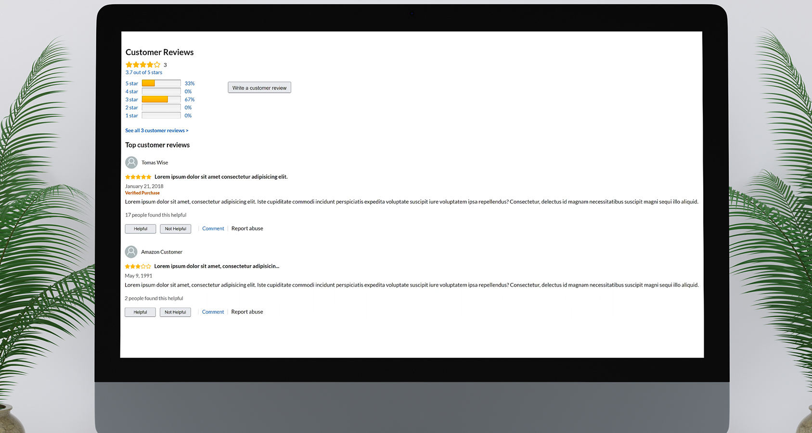

# Ratings & Reviews Microservice
  

A ratings &amp; reviews component for a marketplace product page. Developed for my Front-End Capstone project at Hack Reactor. 

Each member on our dev team selected a component to reproduce from Amazon's product page and developed it independently as a microservice. We rendered them all together through a proxy server and deployed them on independent AWS EC2 instances.

## Technologies Used

* React
* Node
* PostgreSQL
* Styled Components
* Travis CI
* Docker
* AWS EC2
